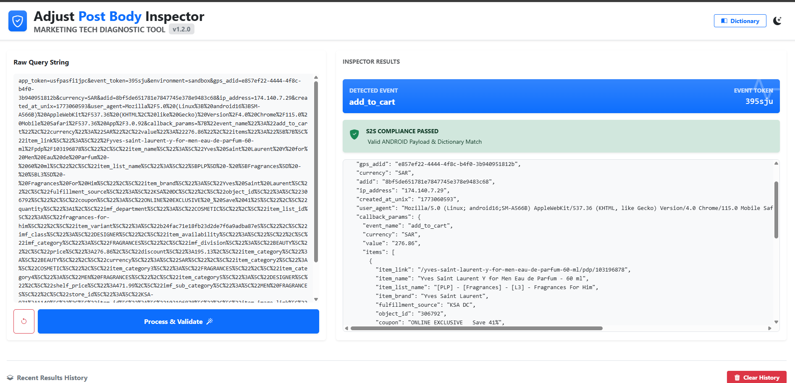

# Adjust Post Body Inspector (v1.1.0)

A specialized **Marketing Tech Diagnostic Tool** designed to validate and inspect Adjust S2S (Server-to-Server) post bodies. This tool ensures that your event data meets Adjust's strict compliance standards before you send it to their production environment.

---

## 🖼 Visual Preview

## 🔗 Live Deployment
**Access the live tool here:** [https://daam.com.sa/adjust-postbody-inspector/](https://daam.com.sa/adjust-postbody-inspector/)

## 🗺 Navigation

The application is structured into three primary functional areas:

### 1. Input Panel (Left)

- **Textarea**: Paste your raw Adjust query string here.
- **Process & Validate**: Triggers the parsing and compliance check logic.
- **Reset (Icon)**: Clears all current inputs and results to start fresh.

### 2. Inspector Results (Right)

- **Dictionary Required State**: A safety screen shown when no event mappings are loaded.
- **Empty State**: Prompting the user to paste a string once the dictionary is ready.
- **Error/Warning View**: Displays syntax errors or "Incomplete JSON" alerts if the string is truncated.
- **Results View**: The main dashboard showing the Event Token, Mapping Status, Compliance Alert, and the formatted JSON tree.

### 3. Global Tools

- **Navbar**: Access the **Event Dictionary** modal and the **Theme Toggle** (Light/Dark mode).
- **History Section**: Found at the bottom of the page to track all validated events in the current session.

---

## 🛠 Tools & Technologies Used

This application is built with a modern web stack for high performance and real-time reactivity:

- **Angular (v17+)**: Core framework utilizing **Signals** for state management.
  - **Computed Signals**: Used for real-time tracking of the dictionary status.
  - **Effects**: Automatically clears the workspace when the dictionary list is modified.
- **Bootstrap 5**: Responsive layout and UI components (cards, badges, alerts).
- **Bootstrap Icons**: Intuitive visual status indicators.
- **NgbModal**: Powers the CSV upload and dictionary management interface.
- **Animate.css**: Smooth transitions for error states and result displays.
- **TypeScript**: Ensures strict type safety for validation logic.

---

## 🚀 Key Features

- **Real-time Dictionary Validation**: Instantly checks if an `event_token` exists in your uploaded CSV.
- **Smart Platform Detection**: Identifies **Android** or **iOS** based on the User Agent string.
- **Compliance Guardrails**:
  - **Android**: Checks for `gps_adid` and flags illegal iOS IDs (`idfa`/`idfv`).
  - **iOS**: Ensures `idfv` is present.
  - **Revenue**: Enforces root-level `revenue` and `currency` for purchase-intent events.
- **Truncation Detection**: Specifically identifies incomplete strings (e.g., ending in `%7`) that break JSON structure.
- **ADID Quick-Copy**: A one-click button to copy the Adjust Device ID for troubleshooting.

---

## 📖 How to Use

### 1. Set Up Your Dictionary

The app needs a reference list to validate tokens.

1.  Click **"Dictionary"** in the top bar.
2.  Upload your event mapping CSV file.
3.  The "Inspector Results" will now unlock.
    _Note: If you update or clear this list, the app will automatically empty your textarea to prevent data mismatch._

### 2. Paste & Process

1.  Copy your raw Adjust post body string.
2.  Paste it into the **Raw Query String** box.
3.  Click **Process & Validate**.

### 3. Review Results

1.  **Check the Token**: Look at the header. A **Green "Mapped" badge** means the token is correct per your dictionary.
2.  **Read the Compliance Alert**:
    - ✅ **Success (Green)**: The payload is ready for Adjust S2S.
    - ❌ **Failed (Red)**: Read the specific error message (e.g., "Missing gps_adid").
3.  **Inspect JSON**: Use the code view at the bottom to see exactly how Adjust sees your data.

---

## ⚠️ Common Validation Alerts

- **Dictionary Error**: The token provided is not in your uploaded CSV.
- **Environment Error**: The string contains an invalid environment (expected `production` or `staging`).
- **Incomplete JSON**: The string was likely cut off during copy-pasting (truncated).
